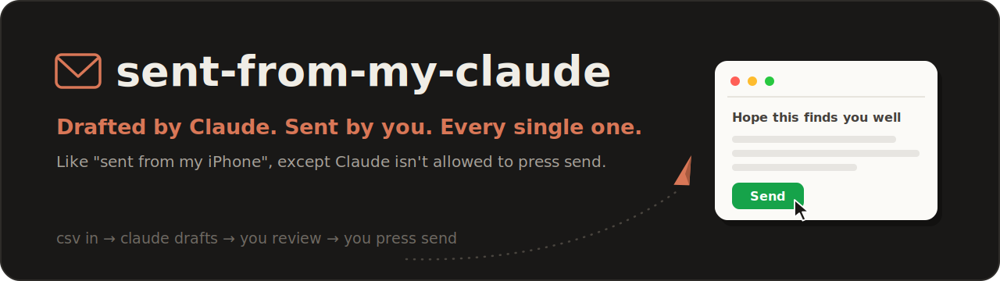

<div align="center">



[](https://github.com/PanchoK50/sent-from-my-claude/stargazers)

[](LICENSE)
[](CONTRIBUTING.md)
[](https://nodejs.org)
[](https://claude.com/claude-code)

</div>

Cold outreach with Claude Code doing the boring parts and you keeping the
finger on the trigger. You hand Claude a CSV of contacts, it dedups against
everyone you already emailed, drafts one personalized email per person in your
voice and with your signature, and opens a local review UI. **You review every
email before it goes out.** Send them one by one in the UI, or tell Claude to
send the whole reviewed batch. Either way, nothing goes out without your go.

Built for customer discovery interviews (student startup projects, user
research), works for any small-batch, high-quality outreach where every email
should look hand-written, because you reviewed it by hand.

```
CSV of contacts
   │
   ▼
/outreach  ──►  Claude: parse → dedup vs sent log/CRM → draft emails
   │
   ▼
Review UI (localhost) ──►  YOU read, edit, send each email
   │
   ▼
sent-log.csv / your CRM  ──►  next wave dedups automatically
```

## What you need

- [Claude Code](https://claude.com/claude-code)
- Node.js 20+
- An email account that allows password-based SMTP. Only tested with
  university mail (TUM via LRZ) so far; other providers are future work, see
  `senders/README.md`

## Quickstart

```bash
git clone https://github.com/PanchoK50/sent-from-my-claude.git
cd sent-from-my-claude
npm install
claude
```

Then, inside Claude Code:

1. **`/outreach-setup`**: Claude interviews you (name, mail provider,
   signature, what your project is), writes your config, and verifies your
   mailbox connection. One-time, ~5 minutes. The only manual step: putting
   your mail password in `senders/<you>.env` (the file is gitignored).
2. Drop a CSV of contacts anywhere in the folder. Rich exports (Apollo,
   LinkedIn tools) or a bare `First Name, Email` list both work.
3. **`/outreach my-contacts.csv`**: answer ~3 questions (which sender, which
   message, what to call the wave). Claude preps everything and stops.
4. Run the command it gives you, e.g. `CAMPAIGN=2026-07-wave-1 npm run ui`,
   open http://localhost:3333, review each email, edit inline if you want,
   and send one by one. Or, once you've reviewed everything, tell Claude
   "send them all" and it batch-sends the reviewed campaign for you.

Try it right now without any setup: `CAMPAIGN=example npm run dry-run` shows
what a send would look like using the bundled fake campaign.

## The rules the kit enforces

- **Human reviews, always.** Claude is instructed (CLAUDE.md + skills) to stop
  at the review UI. Emails go out only on your explicit go: the Send button
  per email, or a direct "send them all" to Claude after you've reviewed.
  Claude never sends on its own initiative.
- **No double-contacting.** Every sent email lands in `sent-log.csv`; the next
  wave drops anyone the same sender already emailed. Follow-ups to the same
  people are possible, but only when you explicitly ask.
- **Secrets stay local.** Credentials live in `senders/*.env`, which is
  gitignored, as are your real campaigns and contact lists.

## Bring your own CRM

Out of the box the kit remembers who you contacted in a plain CSV log (zero
setup). If your team lives in Airtable, Notion, HubSpot, or anything else,
the CRM is a **markdown adapter**: a file in `crm/` telling Claude how to dedup
against and record into your tool, usually via that tool's MCP server. Ship
your own by copying `crm/custom.md`. See `crm/README.md`.

## Repo tour

| Path | What |
|---|---|
| `CAMPAIGNS.md` | the runbook: how a wave works end to end |
| `CLAUDE.md` | the rules Claude follows in this repo |
| `.claude/skills/` | `/outreach` and `/outreach-setup` |
| `campaigns/` | one folder per wave (message + contacts + generated drafts); `example/` shows the format |
| `senders/` | your mailbox creds + email signature (per teammate) |
| `templates/` | reusable message templates with voice rules |
| `crm/` | pluggable CRM adapters (csv-log, airtable, none, custom) |
| `serve.ts` | the local review & send UI |
| `generate.ts` / `send.ts` / `check.ts` | draft generator / CLI sender / creds checker |

## Team usage

Two or three people can share one clone of this repo (or a private fork). Each
teammate adds their own sender in `senders/`, and dedup is per sender, so you
never step on each other's contacts. Point the CRM adapter at a shared base if
you want one view of the whole pipeline.

## Contributing

Ideas that would make great PRs: new CRM adapters (`crm/notion.md`,
`crm/sheets.md`, `crm/hubspot.md`...), mail provider presets, a better review
UI, follow-up wave helpers, docs in other languages.

### 🤖 A note for your agent

If you are a Claude (or any coding agent) reading this because your human
wants to improve the kit: you don't have push access to this repo, and that's
by design. Fork, branch, and open a pull request:

```bash
gh repo fork PanchoK50/sent-from-my-claude --clone
cd sent-from-my-claude && npm install
git checkout -b my-improvement
# make your change, then smoke-test:
npx tsc --noEmit && npm run generate -- example && CAMPAIGN=example npm run dry-run
git commit -am "describe the change"
git push -u origin my-improvement
gh pr create --repo PanchoK50/sent-from-my-claude --title "..." --body "..."
```

Full guidelines (what to check, what never to include) are in
[CONTRIBUTING.md](CONTRIBUTING.md). Fitting the theme of this repo: agents
draft the PR, a human reviews and merges it.

## Contributors

[](https://github.com/PanchoK50/sent-from-my-claude/graphs/contributors)

## FAQ

**What providers does this work with?** Honest answer: it has only been
tested with TUM university mailboxes (LRZ SMTP). Any mailbox that allows a
plain SMTP login should work in principle; Gmail, Outlook, and the other big
providers are untested and on the future-work list. If you get one working,
a PR documenting it would be very welcome.

**Can it send automatically / on a schedule?** There's no scheduler and Claude
never sends on its own initiative; that's the point. What it can do: after
you've reviewed a campaign, tell Claude to send the batch and it fires them
off with a polite delay between emails. The trigger is always you. If you want
drip campaigns, use a marketing tool.

**Emails don't show in my Sent folder.** Set `IMAP_HOST` in your sender `.env`;
the kit copies each sent email to your Sent folder via IMAP.

**Can I A/B test?** Yes: signature variants per contact (see
`senders/README.md`), with per-variant counts in the UI.

## Disclaimer

This is a personal open-source project, not affiliated with, endorsed by, or
connected to the Technical University of Munich (TUM), Anthropic, or any email
provider or institution whose mailbox you use. Emails are sent through **your
own** mail account with **your own** credentials: the author operates no email
infrastructure, relays nothing, and never sees your messages. You alone are
responsible for what you send and for complying with the laws that apply to
you (GDPR and ePrivacy in the EU, UWG in Germany, CAN-SPAM in the US, and so
on) as well as your mail provider's terms of service. Full text:
[DISCLAIMER.md](DISCLAIMER.md).

## License

[MIT](LICENSE). The software is provided "as is", without warranty of any kind.
